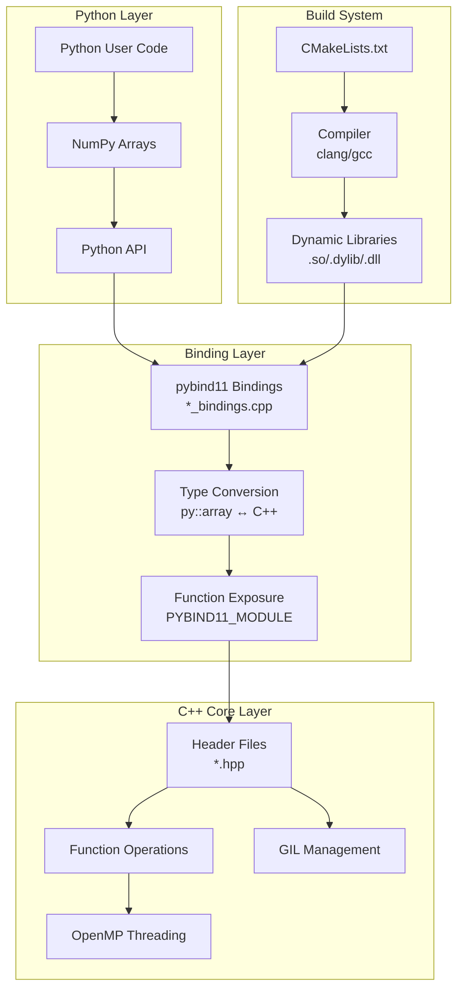

This documentation assumes you have basic knowledge in C/C++ syntax and are familiar with PauliArray's Python code.

There is currently a reformatting and renaming effort throughout the project. Names like 'paulicpp' will be changed to something more generic and appropriate in the near future.

## Code Convention
### Structure
The project structure is the exact same as PauliArray's [Voids](https://github.com/algolab-quantique/pauliarray/tree/Voids) branch, with the following additions:
``` 
├── pauliarray
|   ├── binary
|   ├── conversion
|   ├── estimation
|   ├── mapping
|   ├── pauli
|   ├──utils
|   └── src
|       ├── bindings
|       │   └── {MODULE}_bindings.cpp
|       ├── build
|       │   └── {MODULE}.{dynamic_lib_extension}
|       │   └── {MODULE}.pyi
|       └── {MODULE}.hpp
├── CMakeLists.txt
└── .clang-format
```
- `/src` Contains the C++ source code (.hpp) for every module.
- `/src/bindings` Contains the pybind11 bindings necessary for the translation to and from Python.
- `src/build` Contains the compiled dynamic shared libraries and stub files.
- `CMakeLists.txt` Instruction set to compile the C++ source code.
- `.clang-format` File which instructs how to auto-format C++ code.

### Architecture Overview


### Build Requirements
To build this library from source, you will need:
- Python 3.10+
- GCC or Clang that supports at least C++20
- A 64-bit Unix-like system
- (Optional) libomp/OpenMP

Note: In theory, Windows can compile the entire project with no issues. However, since MSVC is a completely different beast to GCC or Clang, no build options have been added to support it. MinGW would also probably work.

### Understanding Voids
**Voids** (also called "void strings", "binary blobs" or "raw data") refer to the packed bit representation of lists of binary values. This is **not** related to the C/C++ `void` data type.
Voids are usually represent *z, x* in a Pauli string.
- Original Python representation: `z = [0, 1, 1, 0]` (List of booleans)
- Voids representation: `z = 0b0110` or `z = 6` (Single integer)
  
This packed representation significantly reduces memory usage and enables efficient bitwise operations.


### General Coding Standards
**Avoid Manual Broadcasting:** Broadcasting is a complex process that required substantial engineering effort to implement efficiently. Rather than reimplementing broadcasting in C++, either:
- Perform broadcasting in Python before passing data to C++
- Use pybind11's [vectorize()](https://pybind11.readthedocs.io/en/stable/advanced/pycpp/numpy.html#vectorizing-functions) functionality when dealing with simple functions

**Avoid Noncontiguous Data**: The speedup made by this library is mainly due to the contiguity of NDArrays, and how this property can be exploited with extreme compiler optimizations (SIMD) or by careful implementation of certain patterns and structure. For uncontiguous data, either:
- Rearange the data in Python before passing it to C++
- Explicitly state that slowdowns may occur (idk).

**Memory Management:** C++ lacks garbage collection or Rust's borrow checker, so you must manually manage memory efficiently:
- Track pointer lifetimes carefully to avoid dangling pointers
- Avoid unnecessary copies of large Python objects (very expensive in time and memory)
- Prefer zero-copy operations whenever possible
- Only allocate new memory when necessary

**Type Specifications:**
- Use `py::array_t<TYPE>` for typed arrays (e.g., `py::array_t<float>` for NDArrays of floats)
- Use generic `py::array` for voids (packed binary data)

**Binary Data Types:** Since C++ has no native 'binary' type, use these for void operations:
- `uint64_t`: 64-bit unsigned integer (for large data)
- `uint8_t`: 8-bit unsigned integer (for small data)

These types guarantee exact bit lengths and support both arithmetic and binary operations. Avoid:
- `std::byte` (no arithmetic support)
- `unsigned char` (no size guarantee)
- `unsigned long long int` (unnecessarily verbose)

**Do not use `using namespace std;`**
While convenient, namespace imports create ambiguity in low-level code. Both the standard library and pybind11 may define functions with identical names (e.g., `make_tuple()`), which would result in unpredicable function calls. Explicit namespace prefixes ensure:
- Functions are called from the correct library
- Code behavior is predictable
- Future maintainers understand the code's intent

### Docstrings
A Python docstring such as:
``` python

def add_integers(a:int, b:int) -> int:
	"""
	Calculates the sum of two integers
	Args:
		a (int): The first operand
		b (int): The second operand
	Returns:
		int: The sum of both inputs
	"""
	return a + b
```

Is roughly equivalent to the Doxygen comment:
``` c++
/**
* @brief Calculates the sum of two integers
*
* @param a The first integer operand
* @param b The second integer operand
* @return int The sum of both inputs
*/
int add_integers(int a, int b) {
	return a + b;
}
```
Additional Doxygen tags include `@deprecated`, `@attention`, and `@warning`, which are used throughout the project where appropriate.
  

### Auto-formatter
Since Black is only usable for Python files, we instead use `clang-format`, a highly customizable formatter that we can adjust to look more or less like Black.

All of the options are found inside of the `.clang-format` file. As a base, we use LLVM's coding format and override some specific options:
- `UseTab: Never`: Always forces spaces for indentation
- `IndentWidth: 4`: Use 4-space standard for indentation
- `IndentPPDirectives: AfterHash`: Indent preprocessor directives after their '#'

# Interacting with Python
We use [pybind11](https://github.com/pybind/pybind11) to interface between Python and C++. Pybind11 was chosen over alternatives like Boost.Python for its:
- Seamless NumPy NDArray integration
- Superior performance
- Modern C++ support

Include these headers at the top of files that interact with Python:
``` C++
#include <pybind11/pybind11.h>
#include <pybind11/numpy.h>
namespace py = pybind11;
```
Note: Omit `<pybind11/numpy.h>` if you don't use NumPy arrays.

### Writing Functions
To create functions with pybind11, lets take a look and compare NumPy's `bitwise_invert` to our's
  
C++:
``` C++

inline py::array bitwise_not(py::array voids) {
	auto buffer = voids.request();
	const uint64_t *ptr_64 = std::bit_cast<uint64_t *>(buffer.ptr);
	py::array result_arr = py::array(voids.dtype(), buffer.shape);
	// ...
	// [main code loop]
	// ...
	return result_arr
}

```
Lets look at the function declaration:
- `inline` means that the following function will be *expanded* instead of *called* from any other functions. What this means in practice is that the external call will be entirely replaced with the actual code of this function. This increases binary file sizes but reduces traditional function call overhead.
- `py::array` declares an object that is a generic NDArray with no specific type.

And as for the code within the function:
- `auto buffer = voids.request()`: Creates a buffer object with type inferred at compile time. The `request()` method returns a zero-copy view of the NDArray's data when possible.
- `py::array result_arr = py::array(voids.dtype(), buffer.shape)`: Creates a new NDArray with the same dtype and shape as the input. This array can be returned directly to Python.


### Exposing Functions to Python (Bindings)
All C++ functions must be declared in their module's binding file to be accessible from Python.
Lets say we want to add `bitwise_not` to our module,
```C++
#include "your_source_file.hpp"

PYBIND11_MODULE(your_module_name, m) {
    m.doc() = "The description of your module";
    
    m.def("bitwise_not", &bitwise_not, 
          "Flips each bit in an NDArray", 
          py::arg("voids"));
}
```


## Multi-threading
To fully utilize available hardware, we implement multi-threading wherever safe and beneficial. OpenMP provides simple syntax with powerful results while maintaining code readability.
### Using OpenMP
Before adding OpenMP, make it **certain** that your code is thread-safe. Data races and memory corruption are difficult to debug. While mutexes can provide thread safety, they often cause performance degradation in small functions (our primary use case). Use mutexes cautiously and verify they provide net benefits.

As for the syntax, most *for(...)* loops in the project are prefaced with:
``` C++
#ifdef USE_OPENMP
	#pragma omp parallel for if (local_variable >= SOME_MACRO) schedule(static)
#endif
	for (i=0; i<local_variable; i++) {
		// Code that does something which could be multi-threaded
	}
```
- `#ifdef` is a preprocessor directive that only compiles it's code block if the specific macro is defined. In this case, `USE_OPENMP` is our own macro, and is only ever defined within CMake's compiling instruction. This is necessary since if OpenMP is not installed but still tries to compile OMP-specific pragmas, the compiler will throw out an error and exit.
- `#pragma omp parallel for` says that we'll be using OpenMP's directives, which will pass the next *for(...)* loop to multiple threads.
- `if (local_variable >= SOME_MACRO)` assures that the multithreading only occurs if the statement evaluates to True. Usually this is with a counter or size of a data point compared to an arbitrarily chosen constant.
- `schedule(static)` assign each loop iterations to threads in a even, round-robin distribution.

More keywords exist, but they are specific to certain behaviors that are much less common in this project

### Understanding the GIL
Python's Global Interpreter Lock allows only one thread to execute Python bytecode at a time. This simplifies Python's memory management but prevents true multi-threading. Only multiprocessing can achieve true parallelism under the GIL.

However, it is possible to get freed from the shackles of the GIL within C++. This can be done by declaring a section like this:
```C++
{
  py::gil_scoped_release release;
  // very heavy CPU loop (Real multithreading allowed)
}
// The GIL is automaticaly reaquired here
```
Releasing the GIL has some overhead, so it is only useful when code needs to be truly parallelized.
**Release the GIL when:**
- Operations are CPU-intensive and long-running
- No Python API calls are needed
- Using OpenMP or manual threading
  
See `unordered_unique()`'s management of the GIL and OpenMP for more information. It is the very last function inside of `paulicpp/pauliarray/src/paulicpp.hpp`

## Building
WIP
### pyproject.toml
`scikit-build-core` is the build backend as Flit not currently compatible with custom C++ compilation steps.

sasssaaa
  

### CMake
CMake is a cross-platform build tool. It has clean integration with pybind11 and `scikit-build-core` for `pip install` support.

The configuration file is `CMakeLists.txt`, found in the project root.

**Build Options:**
- `USE_OPENMP`: Enable/disable OpenMP multi-threading
    - Default: `ON`
    - Disable manually in `CMakeLists.txt` or via pip: `pip install . --config-settings=cmake.define.USE_OPENMP=OFF`