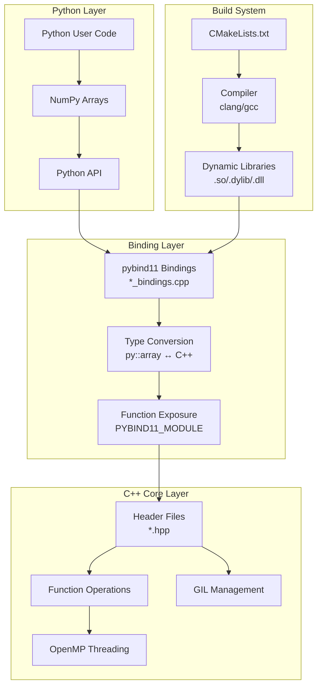

# Project Structure and Architecture
## Structure
The project structure is the exact same as PauliArray's [Voids](https://github.com/algolab-quantique/pauliarray/tree/Voids) branch, with the following additions:
``` 
├── _src
│   ├── bindings
│   │   └── {MOD}_bindings.cpp
│   ├── build
│   │   ├── _{MOD}.[dyn_lib_ext]
│   │   └── _{MOD}.pyi
│   └── {MOD}.hpp
└── {MOD}.py
```
`{MOD}` is a module's name. There can be multiple modules with different names compiled to the same directories. 
- `/_src` Contains the C++ source code (.hpp) for every module.
- `/src/bindings` Contains the pybind11 bindings necessary for the translation to and from Python.
- `src/build` Contains the compiled dynamic shared libraries and stub files.


## Architecture
